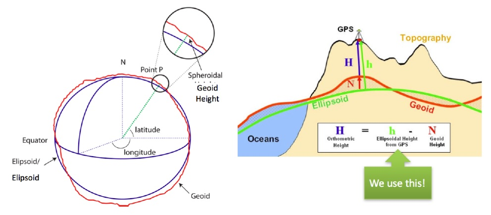

How is the coordinate system defined in Apollo?
===============================================

What coordinate systems are used in Apollo, and how are they defined?

-  Maintainer: <daohu527@gmail.com>
-  Version: 1.0.0
-  Date: 05/09/2024
-  Description:

Answer
------

In the Apollo project, multiple coordinate systems are involved, each with its specific definition and application scenarios. The following are common coordinate systems in Apollo and their definitions:

-  `Global Geographic Coordinate System <#global-geographic-coordinate-system>`__
-  `Local Coordinate System <#local-coordinate-system>`__
-  `Vehicle Coordinate System <#vehicle-coordinate-system>`__

Global Geographic Coordinate System
~~~~~~~~~~~~~~~~~~~~~~~~~~~~~~~~~~

Apollo uses **WGS84 (World Geodetic System 1984)** as the standard coordinate system to represent the longitude and latitude of objects. WGS84 is a coordinate system based on the Earth's ellipsoid, uniquely determining all points on the Earth's surface, except the North Pole, using two angular values: longitude and latitude. Longitude represents the east-west position with a range of -180° to 180°; latitude represents the north-south position with a range of -90° to 90°.

The WGS84 coordinate system is widely used in Geographic Information System (GIS) services, such as mapping, positioning, and navigation.

   world_geodetic_system

Local Coordinate System
~~~~~~~~~~~~~~~~~~~~~~~

The local coordinate system is a three-dimensional Cartesian coordinate system with a specific point on the Earth's surface as the origin, where the X-axis points east, the Y-axis points north, and the Z-axis points up. It is commonly used to represent the relative positions of moving objects such as vehicles or sensors.

The Universal Transverse Mercator (UTM) is a two-dimensional projected coordinate system that divides the Earth's surface into 60 zones. Each zone is called a projection band, 6 degrees wide in longitude, using the transverse Mercator projection.

In the Apollo system, the UTM coordinate system is used as a local coordinate system in modules like positioning and planning.

.. figure:: ../../../../images/local_coordinate_system.png
   :alt: local_coordinate_system
   :align: center

   local_coordinate_system

Vehicle Coordinate System
~~~~~~~~~~~~~~~~~~~~~~~~~

.. figure:: ../../../../images/vehicle_coordinate_system.jpg
   :alt: vehicle_coordinate_system
   :align: center

   vehicle_coordinate_system

These are the common coordinate systems in the Apollo project and their definitions. These coordinate systems play a crucial role in various modules of the autonomous driving system, such as map positioning, vehicle control, and environmental perception. By effectively using these coordinate systems, various functions in the autonomous driving system can be efficiently realized.
