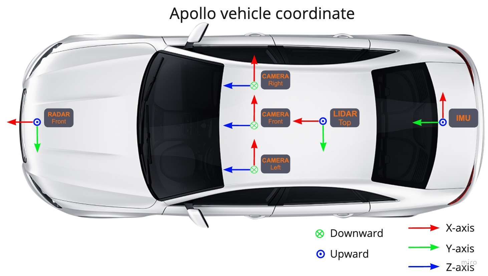

Apollo의 좌표계는 어떻게 정의됩니까?
======================================

Apollo에서는 어떤 좌표계가 사용되며, 그것들은 어떻게 정의됩니까?

-  유지 관리자: <daohu527@gmail.com>
-  버전: 1.0.0
-  날짜: 2024년 5월 9일
-  설명:

답변
------

Apollo 프로젝트에서는 여러 가지 좌표계가 사용되며, 각각 특정 정의와 적용 시나리오가 있습니다. 다음은 Apollo에서의 일반적인 좌표계와 그 정의입니다:

-  `전세계 지리 좌표계 <#전세계-지리-좌표계>`__
-  `국소 좌표계 <#국소-좌표계>`__
-  `차량 좌표계 <#차량-좌표계>`__

전세계 지리 좌표계
~~~~~~~~~~~~~~~~~~~

Apollo는 **WGS84 (World Geodetic System 1984)**를 표준 좌표계로 사용하여 물체의 경도와 위도를 나타냅니다. WGS84는 지구의 타원체를 기준으로 하는 좌표계로, 경도와 위도의 두 각도 값을 사용하여 북극점을 제외한 지구 표면상의 모든 점을 고유하게 결정합니다. 경도는 동서 방향의 위치를 나타내며, 범위는 -180°에서 180°입니다; 위도는 남북 방향의 위치를 나타내며, 범위는 -90°에서 90°입니다.

WGS84 좌표계는 지도 작성, 위치 지정, 내비게이션 등 지리 정보 시스템(GIS) 서비스에 널리 사용됩니다.

.. figure:: ../../../../images/world_geodetic_system.png
   :alt: world_geodetic_system
   :align: center

   world_geodetic_system

국소 좌표계
~~~~~~~~~~~~

국소 좌표계는 지구 표면의 특정 점을 원점으로 하는 3차원 데카르트 좌표계로, X축은 동쪽, Y축은 북쪽, Z축은 하늘을 향합니다. 이는 차량이나 센서와 같은 이동 물체의 상대 위치를 나타내는 데 일반적으로 사용됩니다.

유니버설 횡단 메르카토르(UTM)는 지구 표면을 60개의 지역으로 나누는 2차원 투영 좌표계입니다. 각 지역은 프로젝션 밴드라고 하며, 너비는 6도 경도이고, 횡단 메르카토르 투영이 사용됩니다.

Apollo 시스템에서는 UTM 좌표계가 위치 지정 및 계획 등의 모듈에서 국소 좌표계로 사용됩니다.

.. figure:: ../../../../images/local_coordinate_system.png
   :alt: local_coordinate_system
   :align: center

   local_coordinate_system

차량 좌표계
~~~~~~~~~~~~

   vehicle_coordinate_system

이것이 Apollo 프로젝트에서의 일반적인 좌표계와 그 정의입니다. 이러한 좌표계는 자율 주행 시스템의 다양한 모듈, 지도 위치 지정, 차량 제어, 환경 인식 등에서 중요한 역할을 합니다. 이러한 좌표계를 효과적으로 사용함으로써 자율 주행 시스템 내의 다양한 기능을 효율적으로 실현할 수 있습니다.
