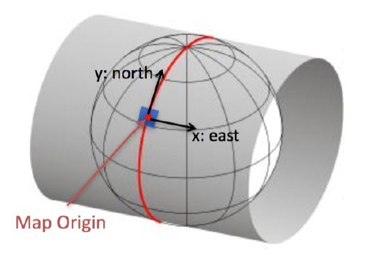
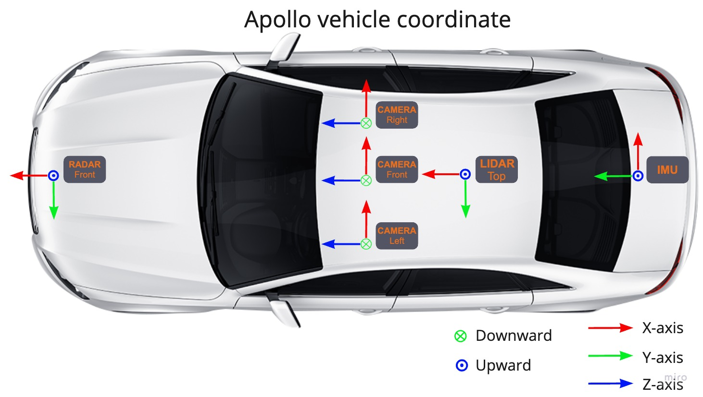

# Apollo的坐标系是如何定义的？

Apollo中的坐标系有哪些，以及它们是如何定义的？

- 维护者：<daohu527@gmail.com>
- 版本：1.0.0
- 日期：05/09/2024
- 描述：

## 回答

在Apollo项目中，涉及到了多种坐标系，每种坐标系都有其特定的定义和应用场景。以下是Apollo中常见的坐标系及其定义：

- [全球地理坐标系](#全球地理坐标系)
- [局部坐标系](#局部坐标系)
- [车辆坐标系](#车辆坐标系)

### 全球地理坐标系
Apollo采用**WGS84（World Geodetic System 1984）**作为标准坐标系来表示物体的经度和纬度。WGS84是一种以地球椭圆体为参考的坐标系，它使用经度和纬度两个角度值来唯一确定地球表面上除北极点之外的所有点。其中，经度表示东西方向的位置，取值范围为-180°至180°；纬度表示南北方向的位置，取值范围为-90°至90°。

WGS84坐标系广泛应用于地理信息系统（GIS）服务，例如地图绘制、定位、导航等。

### 局部坐标系

局部坐标系是一种以地球表面某一点为原点的三维笛卡尔坐标系，其X轴指向东，Y轴指向北，Z轴指向天。它常用于表示车辆或传感器等移动物体的相对位置。

墨卡托正形投影（Universal Transverse Mercator，UTM）是一种将地球表面划分为60个区域的二维投影坐标系。每个区域称为一个投影带，宽度为6度经度，并使用横轴墨卡托投影进行投影。

在Apollo系统中，UTM坐标系统在定位、Planning等模块中作为局部坐标系使用。

### 车辆坐标系

以上就是在Apollo项目中常见的坐标系及其定义。这些坐标系在自动驾驶系统的不同模块中发挥着重要作用，如地图定位、车辆控制、环境感知等。通过合理地使用这些坐标系，可以有效地实现自动驾驶系统中的各种功能。
